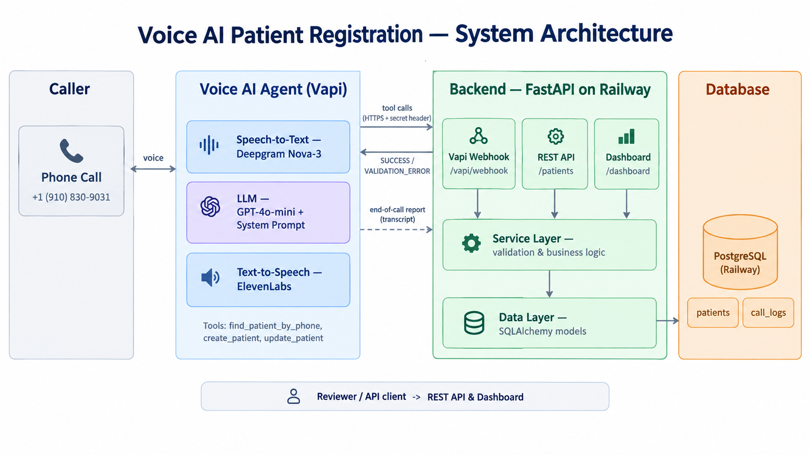
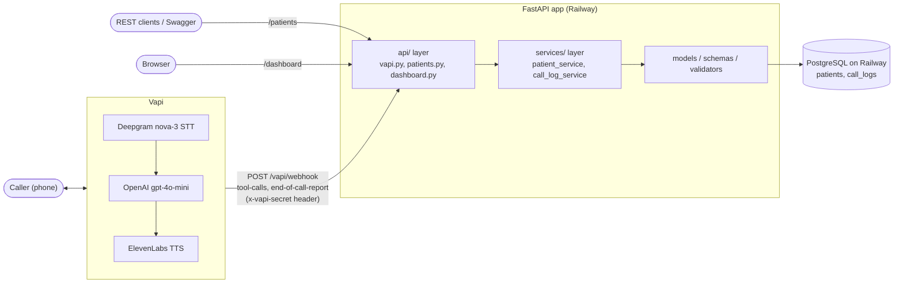

# Patient Registration Voice Agent

A phone-based AI agent that registers new patients for a (fictional) clinic. A caller dials a US number, talks to **Ava**, and their demographics are validated and saved to PostgreSQL. The same records are available through a REST API and a live HTML dashboard.

## Overview

- **Voice intake**: Vapi handles telephony, speech-to-text, the LLM and text-to-speech. Ava collects name, date of birth, sex, phone, address and optional details (email, insurance, emergency contact, preferred language), reads them back, and saves them by calling tools on this backend.
- **Backend**: a FastAPI service with strict server-side validation. The voice webhook and the REST API share one service layer, so both enforce the same rules.
- **Returning callers**: a phone-number lookup detects existing patients. Their record is only updated after the caller's date of birth matches.
- **Observability**: every tool call and call ending is logged as one JSON line. Call transcripts and summaries are stored and shown on the dashboard.

## Live Demo

| | |
|---|---|
| Phone | **+1 (910) 830-9031** |
| API base | https://patient-registration-voice-agent-production-c406.up.railway.app |
| Dashboard | [/dashboard](https://patient-registration-voice-agent-production-c406.up.railway.app/dashboard) (auto-refreshes every 15 s) |
| Swagger UI | [/docs](https://patient-registration-voice-agent-production-c406.up.railway.app/docs) |
| Health | [/health](https://patient-registration-voice-agent-production-c406.up.railway.app/health) |

Call the number, register with fictional details, and the new patient appears on the dashboard within about 15 seconds. The call transcript and summary are attached once the call ends. Two fictional seed patients (Jane Doe, John Smith) are preloaded.

## Architecture





- **`app/api/`** is the HTTP layer only. It parses requests, calls services and shapes responses. `vapi.py` dispatches tool calls, `patients.py` is the REST API, and `dashboard.py` renders HTML.
- **`app/services/`** holds the business logic: create, get, list, update, soft-delete, find by phone, and call-log upserts. The voice agent and the REST API call the same functions.
- **`app/validators.py`** holds pure normalization and validation functions. The Pydantic schemas in `app/schemas.py` reuse them.
- **`app/models.py`** defines the SQLAlchemy 2.0 models `Patient` and `CallLog`.

See [docs/architecture.md](docs/architecture.md) for the component diagram, a sequence diagram of one registration call, and the data model.

## Tech Stack & Justification

| Choice | Why |
|---|---|
| **Vapi** | One platform for the phone number, streaming STT, LLM orchestration, TTS, interruption handling and tool calling. Building that from raw Twilio media streams would take far longer than the time available, and conversation quality is the point of the project. Tools are plain HTTPS webhooks, so the backend stays provider-agnostic. |
| **gpt-4o-mini** | Voice needs low time-to-first-token. Every extra few hundred milliseconds of LLM latency is dead air on the phone. gpt-4o-mini is fast and cheap and handles structured tool calls reliably. The conversation logic is simple enough that a larger model isn't needed, and the backend validates everything anyway. Temperature 0.3 keeps it consistent. |
| **Deepgram nova-3 (`multi`)** + **ElevenLabs `eleven_turbo_v2_5`** | Low-latency streaming transcription with English/Spanish code-switching, and a natural female voice on a multilingual, low-latency TTS model. |
| **FastAPI + Pydantic v2** | Typed request validation, automatic OpenAPI/Swagger docs, and a fast development loop. Pydantic validators express the normalization rules (phone, DOB, state, ZIP) directly. |
| **SQLAlchemy 2.0 + psycopg 3** | Typed ORM models. The same code runs on PostgreSQL in production and in-memory SQLite in tests. |
| **PostgreSQL on Railway** | A real managed database. Container filesystems on Railway and similar hosts are ephemeral, so a SQLite file would be lost on every redeploy. Railway runs the app and Postgres in one project and injects `DATABASE_URL`. It deploys from GitHub with a `Procfile`, and services don't sleep by default, which matters because a cold start during a voice tool call becomes a timeout. Render's free tier sleeps idle web services and time-limits free Postgres, both poor fits for a live phone demo. SQLite is only a local-dev fallback. |

## Setup

### Local

Requires Python 3.11.

```bash
git clone https://github.com/ak-dreambig/patient-registration-voice-agent.git
cd patient-registration-voice-agent
python -m venv .venv
source .venv/bin/activate          # Windows: .venv\Scripts\activate
pip install -r requirements.txt
# No .env needed locally: without DATABASE_URL the app uses ./local.db (SQLite).
# To use Postgres, copy .env.example to .env and fill in real values.
python -m scripts.seed             # optional: insert the two demo patients
uvicorn app.main:app --reload
```

Then open http://localhost:8000/dashboard and http://localhost:8000/docs.

### Deploy (Railway)

1. Create a Railway project from this GitHub repo and add a **PostgreSQL** service.
2. On the web service, set `DATABASE_URL` to reference the Postgres service's URL, and set `VAPI_SECRET` (and optionally `SEED_DEMO_DATA=true`).
3. Railway builds with Python 3.11 (`.python-version`) and starts the app from the `Procfile`: `uvicorn app.main:app --host 0.0.0.0 --port $PORT`.
4. Tables are created automatically on startup. Generate a public domain and check `/health`.

### Configure Vapi

[scripts/setup_vapi.py](scripts/setup_vapi.py) configures everything through the Vapi REST API. It reads `VAPI_API_KEY` and `VAPI_SECRET` from `.env`, and the deployment URL and phone number are constants at the top of the script.

```bash
python -m scripts.setup_vapi
```

It:
- creates or updates the three function tools from [agent/tools.json](agent/tools.json), each pointing at `/vapi/webhook` with an `x-vapi-secret` header.
- creates or updates the assistant "Ava - Patient Intake", using the prompt from [agent/system_prompt.md](agent/system_prompt.md), gpt-4o-mini, the ElevenLabs voice, Deepgram nova-3 multilingual, the `endCall` tool, silence hooks, a 10-minute max duration, and `end-of-call-report` / `status-update` server messages.
- attaches the assistant to the phone number.

It's idempotent: tools are matched by function name and the assistant by name, so re-running it updates them instead of creating duplicates.

## Environment Variables

| Variable | Required | Default | Description |
|---|---|---|---|
| `DATABASE_URL` | In production | `sqlite:///./local.db` | Postgres URL. `postgres://` and `postgresql://` are rewritten to `postgresql+psycopg://`. |
| `VAPI_SECRET` | Recommended | unset | If set, `/vapi/webhook` requires a matching `x-vapi-secret` header (compared with `hmac.compare_digest`), otherwise it returns 401. |
| `LOG_LEVEL` | No | `INFO` | Root log level. |
| `SEED_DEMO_DATA` | No | `false` | If `true`, insert two fictional patients on startup when the table is empty. |
| `VAPI_API_KEY` | Only for `setup_vapi.py` | – | Vapi private API key. Local `.env` only; never committed. |

## API Reference

Every REST response uses one envelope:

```json
{"data": <object | list | null>, "error": null | {"code": "...", "message": "...", "details": [{"field": "...", "message": "..."}]}}
```

Error codes: `validation_error` (422), `bad_request` (400), `not_found` (404), `unauthorized` (401, webhook only) and `internal_error` (500, with no stack trace in the response).

| Method | Path | Description | Status codes |
|---|---|---|---|
| GET | `/health` | Runs `SELECT 1` against the DB | 200, 500 |
| GET | `/patients` | Non-deleted patients, newest first. Filters: `last_name` (case-insensitive exact), `date_of_birth` (MM/DD/YYYY or YYYY-MM-DD), `phone_number` (any format) | 200, 400 |
| GET | `/patients/{id}` | One patient | 200, 400 (bad UUID), 404 |
| POST | `/patients` | Create | 201, 400 (malformed JSON), 422 |
| PUT | `/patients/{id}` | Partial update; only the fields sent change; `updated_at` is bumped | 200, 400, 404, 422 |
| DELETE | `/patients/{id}` | Soft delete (sets `deleted_at`); returns the record | 200, 400, 404 |
| GET | `/patients/{id}/calls` | Call logs linked to the patient | 200, 400, 404 |
| POST | `/vapi/webhook` | Vapi server messages (see Voice Agent Design) | 200, 401 |
| GET | `/dashboard` | HTML dashboard, `?q=` searches by last name or phone | 200 |
| GET | `/` | Redirects to `/dashboard` | 307 |

Set `BASE=https://patient-registration-voice-agent-production-c406.up.railway.app` for the examples below.

**Create a patient**, with input normalized on the way in:

```bash
curl -X POST $BASE/patients -H 'content-type: application/json' -d '{
  "first_name": "Test", "last_name": "Example", "date_of_birth": "07/04/1992", "sex": "other",
  "phone_number": "(415) 555-0123", "email": "Test.Example@Example.com",
  "address_line_1": "789 Fiction Blvd", "city": "San Francisco", "state": "California",
  "zip_code": "941031234", "insurance_member_id": "abc-123 45"
}'
```

```json
{"data": {"patient_id": "46568b9f-ff9f-421c-993b-83fceffd1479", "first_name": "Test", "last_name": "Example",
  "date_of_birth": "07/04/1992", "sex": "Other", "phone_number": "4155550123", "email": "test.example@example.com",
  "address_line_1": "789 Fiction Blvd", "address_line_2": null, "city": "San Francisco", "state": "CA",
  "zip_code": "94103-1234", "insurance_provider": null, "insurance_member_id": "ABC12345",
  "preferred_language": "English", "emergency_contact_name": null, "emergency_contact_phone": null,
  "created_at": "2026-09-24T13:48:42.691575+00:00", "updated_at": "2026-09-24T13:48:42.691582+00:00",
  "deleted_at": null}, "error": null}
```

**Validation error (422)**, where each problem names its field in plain English:

```bash
curl -X POST $BASE/patients -H 'content-type: application/json' -d '{"first_name":"Bad","last_name":"Data",
  "date_of_birth":"01/01/2099","sex":"Male","phone_number":"555","address_line_1":"1 X St",
  "city":"Austin","state":"TX","zip_code":"73301"}'
```

```json
{"data": null, "error": {"code": "validation_error", "message": "One or more fields are invalid.", "details": [
  {"field": "date_of_birth", "message": "Date of birth cannot be in the future."},
  {"field": "phone_number", "message": "Phone number must have exactly 10 digits, including the area code."}]}}
```

**Filter, update, delete:**

```bash
curl "$BASE/patients?phone_number=212-555-0143"          # -> [Jane Doe]
curl "$BASE/patients?last_name=doe&date_of_birth=1988-04-12"
curl -X PUT $BASE/patients/$ID -H 'content-type: application/json' -d '{"city": "Oakland"}'
curl -X DELETE $BASE/patients/$ID                           # then GET $BASE/patients/$ID -> 404
```

```json
{"data": null, "error": {"code": "not_found", "message": "No patient found with id 46568b9f-....", "details": []}}
```

**Vapi tool call**, which always returns HTTP 200 with a status-prefixed string:

```bash
curl -X POST $BASE/vapi/webhook -H 'content-type: application/json' -H "x-vapi-secret: $VAPI_SECRET" -d '{
  "message": {"type": "tool-calls", "call": {"id": "call_123"},
    "toolCallList": [{"id": "tc_1", "type": "function",
      "function": {"name": "find_patient_by_phone", "arguments": {"phone_number": "2125550143"}}}]}}'
```

```json
{"results": [{"toolCallId": "tc_1",
  "result": "FOUND: patient_id=8326644b-e9d5-4136-845f-ff8b3aa2d8fb; first_name=Jane; last_name=Doe; date_of_birth=04/12/1988"}]}
```

### Validation rules

The rules below apply to both the REST API and the voice tools. Inputs are normalized first, then validated.

| Field | Rule |
|---|---|
| first/last name | 1–50 chars. Letters, apostrophes, hyphens and internal spaces; must start with a letter. |
| date_of_birth | `MM/DD/YYYY` or `YYYY-MM-DD`. Must be a real date, not in the future, and not before 1900-01-01. Output is `MM/DD/YYYY`. |
| sex | Case-insensitive `Male`/`Female`/`Other`/`Decline to Answer`, plus `m`, `f`, `decline`, `prefer not to say` |
| phone numbers | Non-digits are stripped and a leading `1` is dropped. Must be exactly 10 digits, and neither the area code nor the exchange may start with 0 or 1. |
| state | 2-letter code or full name, stored as the uppercase code. Covers the 50 states, DC, PR, GU, VI, AS and MP. |
| zip_code | `12345` or `12345-6789`; 9 bare digits are reformatted |
| email | Optional, syntax-checked, lowercased |
| insurance_member_id | Optional. Spaces and hyphens removed, alphanumeric only, uppercased. |
| preferred_language | Optional, defaults to `English`, title-cased |
| all strings | Trimmed, control characters rejected, lengths capped. Empty optional fields become `null`. |

## Voice Agent Design

The full prompt is in [agent/system_prompt.md](agent/system_prompt.md), and the tool schemas are in [agent/tools.json](agent/tools.json).

**Conversation flow**
1. Ava greets the caller and asks for their first and last name, then confirms the spelling of the last name.
2. She asks for the phone number. As soon as she has a valid 10-digit number, she calls **`find_patient_by_phone`** (see Returning callers below).
3. She collects date of birth, sex, and address (street, unit, city, state, ZIP).
4. She offers the optional fields once: email, insurance, emergency contact, preferred language.
5. She reads everything back in two short chunks and waits for an explicit "yes, that's correct."
6. She calls **`create_patient`**, confirms, and ends the call with the `endCall` tool.

**Conversational robustness** (rules written into the prompt):
- **Out-of-order answers**: if a caller volunteers several details at once, Ava captures all of them and only asks for what's still missing.
- **Corrections**: accepted at any point. The latest value wins and is briefly confirmed ("Got it, Davis, D A V I S").
- **Start over**: Ava says "No problem, let's start fresh", discards what was collected, and restarts from the name.
- **Interruptions**: Vapi stops TTS when the caller barges in, and the prompt tells Ava to respond to what was said.
- **Voice-first style**: short turns, one question at a time, no lists or symbols. Phone numbers are spoken in groups, dates are spoken naturally, and state names are said in full.
- **Spanish**: Ava switches fully to Spanish if the caller does and sets `preferred_language` to Spanish. Tool argument formats stay the same.
- **Light client-side checks**: Ava re-asks right away for obviously bad values (e.g. a 3-digit phone or a future DOB), but the backend remains the source of truth.

**Returning-caller flow with DOB verification**
1. `find_patient_by_phone` returns `FOUND` with the patient's name and their stored DOB. The DOB is only there for verification.
2. Ava asks whether the caller wants to update their existing record. If they do, she asks for their date of birth and compares it silently. She never reads the stored DOB aloud.
3. **Match**: she collects only the fields to change, reads back just those changes, and calls `update_patient` with `patient_id` and the changed fields.
4. **No match**, or the caller isn't that person (e.g. a family member sharing a phone): she proceeds with a normal new registration without revealing anything else.

**Tool result status protocol.** Every tool result starts with a status token that the prompt tells Ava how to handle:

| Token | Meaning | Agent behavior |
|---|---|---|
| `SUCCESS:` | Created or updated, includes `patient_id` | Confirm, close, end the call |
| `FOUND:` | Phone matches an existing patient | Returning-caller flow |
| `NOT_FOUND:` | No match on lookup, or unknown `patient_id` on update | Lookup: continue silently. Update: offer a new registration. |
| `VALIDATION_ERROR: field: message; ...` | Server rejected specific fields | Re-ask only those fields, then retry the tool |
| `SYSTEM_ERROR:` | Database or unexpected failure | Retry once. If it fails again, apologize and ask the caller to call back. Never claim the record was saved. |

## Edge Cases Handled

- **Invalid date of birth**: impossible dates like 02/30, future dates, pre-1900 dates and unknown formats are all rejected with a field-specific message. The agent re-asks for just that field.
- **Invalid phone numbers**: wrong length, or an area code or exchange starting with 0 or 1, is rejected. `+1`, dashes, dots, spaces and parentheses are all normalized to 10 digits.
- **Database write failure**: each tool call runs in its own try/except. A failure rolls back the session, is logged with a traceback, and returns `SYSTEM_ERROR` with HTTP 200, never a 500 or a hang. The agent retries once, then apologizes.
- **Save succeeds but call-log link fails**: this is logged, and the tool still returns `SUCCESS`, so the agent never retries a create that actually worked and makes a duplicate.
- **Dropped or abandoned calls**: the `end-of-call-report` is still stored in `call_logs` with its transcript, summary and ended reason, and `patient_id = null` if nothing was saved. Nothing is written to `patients` without explicit confirmation.
- **Duplicate phone numbers**: `phone_number` is intentionally not unique. The lookup returns the most recently updated match, and the agent handles the ambiguity in conversation (see Returning callers).
- **Silence**: Vapi `customer.speech.timeout` hooks. After 10 s of silence Ava asks "Are you still there?". After a further 20 s she says goodbye and ends the call with `endCall`. Calls are capped at 10 minutes (`maxDurationSeconds: 600`).
- **Slow database**: Postgres connections use a 5 s connect timeout, a 5 s `statement_timeout` and a 5 s pool checkout timeout, so a stalled DB produces a fast `SYSTEM_ERROR` well within Vapi's 20 s tool timeout.
- **Malformed webhook payloads**: tool calls are accepted under either `toolCallList` or `toolWithToolCallList[].toolCall`, and arguments as either an object or a JSON string. Unparseable arguments return `VALIDATION_ERROR`, and unknown message types get an empty 200.
- **Bad REST input**: malformed JSON → 400, bad UUID → 400, bad filter values → 400, an empty update body → 400, an unknown id or a soft-deleted record → 404.

## Observability

- **Structured logs**: every log line goes to stdout as one JSON object (`ts`, `level`, `logger`, `event`, plus extra fields). Events include `tool_call` (call_id, tool, arguments, result status), `patient_created`, `patient_updated`, `patient_deleted`, `call_ended` (with the final saved payload and ended reason), `tool_call_failed` and `unhandled_error` (with tracebacks). Uvicorn's own access log stays in its default plain-text format.
- **`call_logs` table**: one row per Vapi call, keyed by `vapi_call_id`. It holds the transcript, summary, ended reason, the last payload sent to `create_patient`/`update_patient`, and the linked `patient_id`.
- **Dashboard**: each patient row expands to show every field and its linked calls, with summary, ended reason and the full transcript. It is also available as JSON at `GET /patients/{id}/calls`.

## Testing

68 tests. They run against in-memory SQLite and finish in about a second.

```bash
pytest -q
```

| File | Covers |
|---|---|
| `tests/test_validators.py` | Phone normalization and rejection, both DOB formats, future/impossible/pre-1900 DOB, state names → codes, ZIP+4 and 9-digit ZIP, names with apostrophes and hyphens, names with digits, sex aliases, member ID, control characters, schema-level error messages |
| `tests/test_patients_api.py` | 201 plus envelope, 422 with field details, malformed JSON, get by id, invalid UUID, filters, partial update bumping `updated_at`, soft delete, calls endpoint, dashboard search, seeding |
| `tests/test_vapi_webhook.py` | `create_patient` SUCCESS and call linking, VALIDATION_ERROR naming the field, FOUND/NOT_FOUND, JSON-string arguments, `toolWithToolCallList` shape, `update_patient`, simulated DB failure → SYSTEM_ERROR with HTTP 200, end-of-call report stored, dropped call, wrong secret → 401 `unauthorized` |
| `tests/test_health.py` | `/health`, `/` redirect |

## Known Limitations & Trade-offs

- **No migrations**: tables are created with `Base.metadata.create_all()` on startup. That's fine for a fresh schema, but column changes to existing tables would need Alembic.
- **Phone number is not unique** by design, because family members often share a number. Duplicates are resolved in conversation instead of by a DB constraint. The trade-off is that a caller who declines the "update your record" path can end up with a second record.
- **Not HIPAA-compliant**: there's no BAA with Vapi, OpenAI or Railway, no encryption beyond what the providers offer, and no audit trail. Logs include tool arguments, which contain PII. Use fictional data only.
- **Webhook auth is a shared-secret header**, not a request signature, and the REST API and dashboard have **no authentication**. Anyone with the URL can read or change records.
- **Names allow internal spaces** ("Mary Ann"), a deliberate relaxation of a strict letters/hyphens/apostrophes rule.
- **Calls with no saved patient** are stored in `call_logs`, but they're only visible in the database and logs. The dashboard and API show calls linked to a patient.
- **Soft-deleted records** stay in the database and can't be restored through the API.

## Next Steps

- **Appointment scheduling**: add availability lookup and booking tools so Ava can book the first visit on the same call.
- **Alembic migrations** to replace `create_all`.
- **Authentication** on the REST API and dashboard (API keys or OAuth), plus Vapi request-signature verification.
- **SMS confirmation** after registration, summarizing the details saved and giving next steps.
- **Call analytics**: completion rate, average call duration, most frequently corrected fields, and drop-off points, built from `call_logs` and the structured logs.
