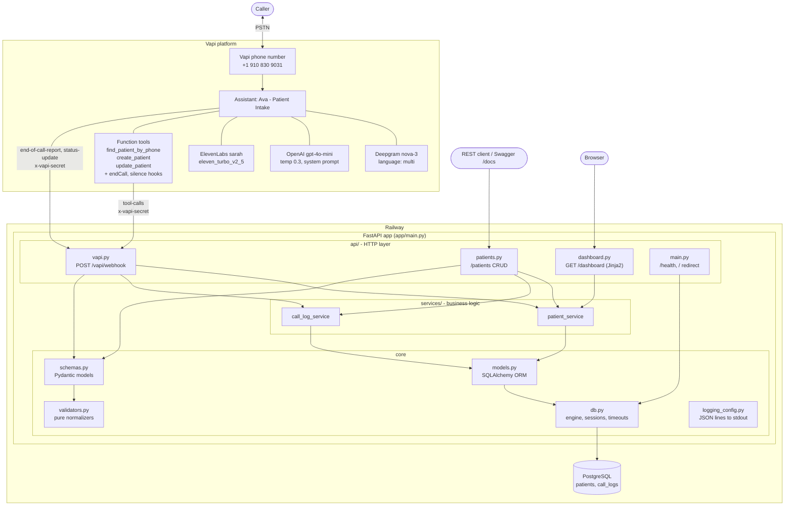
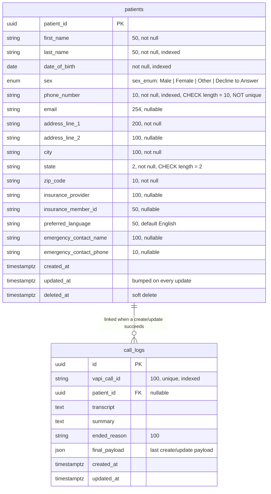

# Architecture

This document goes deeper than the [README](../README.md): the components, one registration call end to end, the data model, and how errors are contained.

## 1. Components



### Layering rules

| Layer | Owns | Must not |
|---|---|---|
| `api/` | Parsing HTTP and webhook payloads, choosing status codes, formatting envelopes and tool-result strings | Contain business rules or query the database directly |
| `services/` | Creates, lookups, filters, partial updates, soft delete, call-log upserts, commits | Know about HTTP, Vapi or response formats |
| `schemas.py` / `validators.py` | Normalization and validation, with plain-English error messages | Touch the database |
| `models.py` / `db.py` | Table definitions, engine configuration | Validate input |

The voice webhook and the REST API call the **same** `patient_service` functions with the **same** `PatientCreate` and `PatientUpdate` schemas. A phone number, DOB or state is therefore normalized and rejected the same way whether it arrives by voice or by `curl`.

### Configuration and startup

- `config.py` reads `DATABASE_URL`, `VAPI_SECRET`, `LOG_LEVEL` and `SEED_DEMO_DATA` via `pydantic-settings`.
- `db.py` rewrites `postgres://` and `postgresql://` to `postgresql+psycopg://`, and falls back to `sqlite:///./local.db` if the URL is unset. On Postgres it sets `connect_timeout=5`, `statement_timeout=5000` ms and `pool_timeout=5`, with `pool_pre_ping`.
- On startup the lifespan hook runs `Base.metadata.create_all()`. If `SEED_DEMO_DATA=true`, it also runs `scripts.seed.seed_if_empty()`; a seeding failure is logged and never blocks startup.

## 2. One registration call

This covers a new caller whose phone number isn't on file, including one server-side validation retry.

```mermaid
sequenceDiagram
    autonumber
    actor C as Caller
    participant V as Vapi (STT, gpt-4o-mini, TTS)
    participant W as FastAPI /vapi/webhook
    participant S as patient_service
    participant L as call_log_service
    participant DB as PostgreSQL

    C->>V: Dials +1 910 830 9031
    V-->>C: "Hi, thanks for calling Riverside Family Clinic... first and last name?"
    C->>V: Name, last-name spelling
    C->>V: Phone number
    V->>W: tool-calls: find_patient_by_phone {phone_number}
    W->>W: verify x-vapi-secret, normalize phone
    W->>S: find_by_phone("2125550143")
    S->>DB: SELECT ... WHERE phone_number = ? AND deleted_at IS NULL<br/>ORDER BY updated_at DESC
    DB-->>S: no rows
    W-->>V: 200 {"results":[{"toolCallId", "result":"NOT_FOUND: ..."}]}
    Note over V,C: NOT_FOUND: continue without mentioning the lookup
    C->>V: DOB, sex, address, optional details (any order, with corrections)
    V-->>C: Reads details back in two chunks
    C->>V: "Yes, that's all correct"
    V->>W: tool-calls: create_patient {all fields}
    W->>W: PatientCreate.model_validate(args)
    W-->>V: 200 "VALIDATION_ERROR: zip_code: ZIP code must be 5 digits, or 5 digits plus 4 (12345-6789)."
    V-->>C: "Sorry, could I get your ZIP code again?"
    C->>V: Corrected ZIP
    V->>W: tool-calls: create_patient {all fields, fixed zip}
    W->>S: create_patient(PatientCreate)
    S->>DB: INSERT INTO patients ... COMMIT
    W->>L: link_patient(call_id, patient_id, payload)
    L->>DB: UPSERT call_logs (patient_id, final_payload)
    W-->>V: 200 "SUCCESS: Patient registered. patient_id=...; first_name=Jane"
    V-->>C: "You're all set, Jane..." (endCall tool)
    V->>W: end-of-call-report {transcript, summary, endedReason}
    W->>L: record_call_end(call_id, ...)
    L->>DB: UPDATE call_logs SET transcript, summary, ended_reason
    W-->>V: 200 {}
    Note over W: log event "call_ended" with final_payload + ended_reason
```

### Returning caller (variant)

If `find_patient_by_phone` returns `FOUND: patient_id=...; first_name=...; last_name=...; date_of_birth=MM/DD/YYYY`, the prompt tells Ava to:

1. offer to update the existing record;
2. ask for the caller's DOB and compare it silently with the one in the tool result, never reading it aloud;
3. if it matches, call `update_patient {patient_id, <changed fields only>}`. `patient_service.update_patient` applies only the fields that were sent (`model_dump(exclude_unset=True)`) and bumps `updated_at`;
4. if it doesn't match, or the caller is a different person sharing the phone, run a normal `create_patient` registration.

## 3. Data model



- **Portable constraints only.** The length `CHECK`s, `NOT NULL` and the enum work on both PostgreSQL and SQLite, so tests exercise the same schema. Regex-level rules live in `validators.py`.
- **`phone_number` is not unique** because households share phones. Duplicate detection happens in the conversation.
- **Soft delete.** Every read path filters `deleted_at IS NULL`, so deleted patients return 404 and are excluded from lookups, lists and the dashboard.
- **`call_logs` upserts** are keyed by `vapi_call_id`. `get_or_create` catches the `IntegrityError` from a concurrent insert, rolls back and re-reads, so a tool call and the end-of-call report arriving together can't create two rows.

## 4. Error containment

| Where | Failure | Result |
|---|---|---|
| Webhook auth | Missing or wrong `x-vapi-secret` (when `VAPI_SECRET` is set) | 401 `unauthorized` |
| Tool argument parsing | Non-JSON string or non-object arguments | `VALIDATION_ERROR: arguments: ...` |
| Schema validation | Bad or missing fields | `VALIDATION_ERROR: <field>: <message>; ...` (voice), 422 with `details` (REST) |
| Service | Unknown or deleted `patient_id` | `NOT_FOUND: ...` (voice), 404 (REST) |
| Any tool exception (DB down, timeout, bug) | Caught per tool call | Session rolled back, `tool_call_failed` logged with traceback, `SYSTEM_ERROR: The record could not be saved due to a technical problem.`, HTTP 200 |
| Linking a saved patient to its call | Caught separately | Logged as `call_link_failed`; the tool still returns `SUCCESS`, so the agent doesn't retry and duplicate |
| End-of-call report | Missing call id or DB error | Logged; still `{}` with HTTP 200 |
| REST unhandled exception | Global handler | `unhandled_error` logged with traceback, 500 `internal_error` envelope with no stack trace |

Each tool call runs independently, so if Vapi batches several calls in one request, a failure in one doesn't affect the others' results.

## 5. Observability

- **Logs** go to stdout as JSON lines, collected by Railway. The key events are `tool_call` (call_id, tool, arguments, status token), `patient_created`, `patient_updated`, `patient_deleted`, `call_ended` (final payload and ended reason), `tool_call_failed`, `call_link_failed` and `unhandled_error`.
- **Call records** are in `call_logs`, exposed per patient at `GET /patients/{id}/calls` and in the dashboard's expandable rows with the summary and transcript. The dashboard refreshes every 15 seconds.

## 6. Vapi configuration as code

`scripts/setup_vapi.py` builds the whole Vapi side from files in this repo: the tool schemas in `agent/tools.json` and the prompt in `agent/system_prompt.md`, after the `BEGIN PROMPT` marker with HTML comments stripped. Tools are matched by function name and the assistant by name, then created or PATCHed, so the script is safe to re-run after editing the prompt. The assistant's `serverMessages` deliberately exclude `tool-calls`: each tool has its own server URL, and the assistant server only receives `end-of-call-report` and `status-update`.
